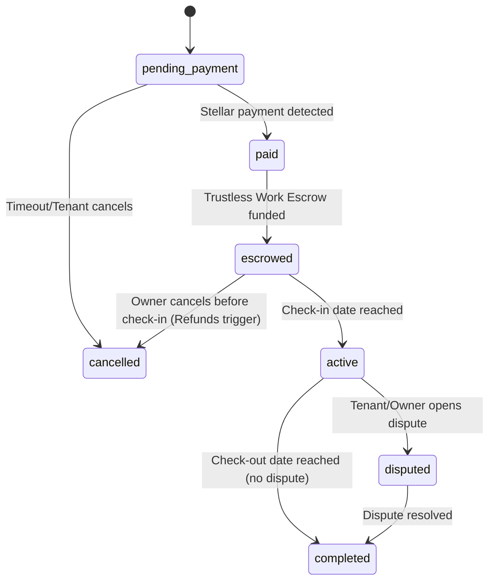

# Definition: Reservation

A Reservation captures the booking agreement between a Tenant and an Owner for a specific Listing over a range of dates.

## Key Attributes
- `id` (UUID): Unique internal identifier.
- `listing_id` (UUID): References the listing.
- `tenant_id` (UUID): References the tenant.
- `check_in` (Date): Check-in date.
- `check_out` (Date): Check-out date.
- `subtotal_usdt` (Numeric): Price per night * number of nights.
- `security_deposit_usdt` (Numeric): The required security deposit.
- `platform_fee_usdt` (Numeric): Fee charged by the platform.
- `status` (Enum): The current state of the booking.
- `created_at` (Timestamp): Creation timestamp.

## Status State Machine

- **pending_payment**: Reservation created, awaiting Stellar transfer.
- **paid**: Rent & deposit received on the pool wallet.
- **escrowed**: Rent held in settlement and deposit locked in Trustless Work Escrow.
- **active**: The guest has checked in.
- **completed**: Checkout completed, funds released to owner, deposit returned to tenant.
- **cancelled**: Reservation aborted, funds returned to respective parties.
- **disputed**: Collateral locked due to damage claims or complaints.
