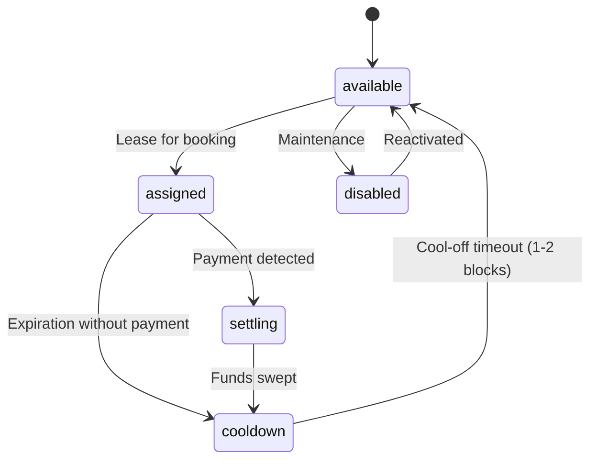

# Definition: Wallet & Wallet Pool

A Wallet represents a Stellar cryptographic keypair managed by the platform. The **Wallet Pool** is a collection of these wallets leased dynamically to match incoming reservations without requiring transaction memos.

## Key Attributes
- `id` (UUID): Unique internal identifier.
- `public_key` (String): The Stellar public key (G...).
- `encrypted_secret_key` (String): The AES-256-GCM encrypted Stellar secret seed (S...).
- `encryption_iv` (String): Hex IV used for AES encryption.
- `encryption_tag` (String): Hex auth tag used for AES GCM authentication.
- `status` (Enum): The current status of the wallet.
- `last_horizon_cursor` (String): Last transaction cursor processed.
- `last_polled_at` (Timestamp): Timestamp of last execution check.

## Wallet Pool Status transitions
- **available**: Free to be assigned to any new `payment_intent`.
- **assigned**: Leased to an active reservation check. Polled for incoming transactions.
- **settling**: Payment captured, moving funds to Treasury / Trustless Work contract.
- **cooldown**: Settlement done. Kept idle for 1-2 blocks to ensure no double-transactions or late receipts.
- **disabled**: Taken out of rotation for key rotations or errors.

