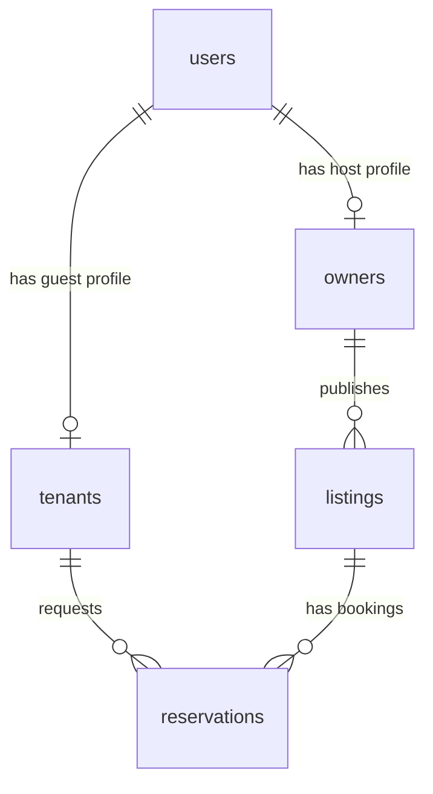

# User, Owner & Tenant Administration Guide

This guide describes the architecture and administration workflows for managing users, hosts (owners), and guests (tenants) in the Vytrosti Protocol.

## Architecture & Data Model

Vytrosti decouples user identities from role-specific coordinates (Stellar public keys) and application metadata to keep the core domain independent of authentication infrastructure.



### 1. Users (`public.users`)
Represents the main identity on the platform. It holds basic profile details and is linked to the authentication proxy session by email:
- `id` (UUID, primary key)
- `name` (Text, not null)
- `email` (Text, not null, unique)
- `createdAt` (Timestamp)

### 2. Hosts / Owners (`public.owners`)
Represents the profile of a user who registers properties and receives rent payments:
- `id` (UUID, primary key)
- `userId` (UUID, unique, references `users.id`) -> one-to-one mapping
- `stellarPublicKey` (Text, not null) -> Host's payment coordinates
- `createdAt` (Timestamp)

### 3. Guests / Tenants (`public.tenants`)
Represents the profile of a user who requests reservations and puts up escrow security deposits:
- `id` (UUID, primary key)
- `userId` (UUID, unique, references `users.id`) -> one-to-one mapping
- `stellarPublicKey` (Text, not null) -> Guest's payment coordinates
- `createdAt` (Timestamp)

---

## Neon Auth Integration & Mapping

When a user registers or logs in via Neon Auth (our authentication proxy), they are added upstream and synced to `neon_auth.user` local table. The application session contains the user's email.

1. **Host details in Listings:** The listings detail view (`/listings/[id]`) queries the listing table, joins `owners` via `ownerId`, and joins `users` via `userId` to dynamically display the Host's name (`listing.owner.user.name`).
2. **Dynamic Tenant Association on Booking:** When a guest requests a booking via the public UI, `createBooking` checks the active session:
   - It queries `public.users` matching `session.user.email`.
   - If the user record does not exist in `public.users`, it dynamically registers them in the public users table using the session details (email, name).
   - It then locates or creates a tenant profile for the user in `public.tenants`, mapping their `userId` and updating their Stellar coordinates if they provided a new one.

---

## Automatic Ledger Account Registration

Every time a new Host or Guest profile is created (either via the seeder, the admin dashboard, or dynamically on booking), the system automatically initializes their corresponding liability account in the protocol's double-entry ledger:
- **Host Account:** `liabilities:owners:${owner.id}` named `${user.name} Owed Balance`.
- **Guest Account:** `liabilities:tenants:${tenant.id}` named `${user.name} Refundable Deposits`.

This ensures that the general ledger is immediately ready to track bookings, payments, and refunds for the new user profile, maintaining balanced double-entry accounting.

---

## Backoffice Portal Management

Admins can manage the users and their roles under the **Users & Roles** tab in the admin dashboard (`/admin`):

1. **Users Registry:** Lists all system users with their emails, active roles (Host, Guest, Admin), and creation date.
2. **Hosts Registry:** Shows host users, their Stellar coordinates, active listings, and cumulative bookings received.
3. **Guests Registry:** Shows guest users, their Stellar coordinates, and bookings history.
4. **Register User & Roles Form:** Allows registering a user dynamically, selecting their roles, and configuring their StellarCoordinates. This automatically creates their profile records and initializes their ledger liability accounts.

---

## Local Verification & Setup

To reset the database and seed the default listings, wallets, ledger accounts, public users, host/guest profiles, and upstream auth users, run:

```bash
npm run db:setup
```

Or just seed the database:

```bash
npm run db:seed
```

Start the local server:

```bash
npm run dev
```

Log in as the platform admin user at `/login` (using **Quick Fill Admin** or credentials `admin.demo@vytrosti.com` / `Vytr0sti#Admin2024!`) and navigate to `/admin` to verify.
