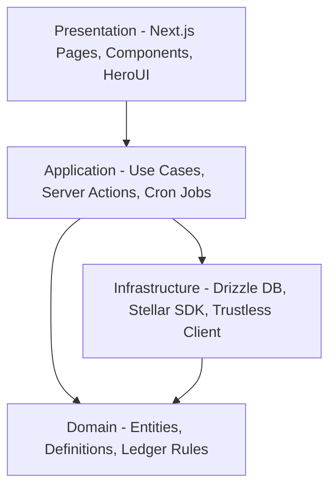

# Architecture Rules

We enforce a Clean Architecture style to separate domain policy from detail implementation.

## Layers

### 1. Domain Layer
- **Description**: Contains all core rules, business objects, ledger entry definitions, and state machines.
- **Rule**: Must be pure TypeScript. No external infrastructure dependencies (e.g. `stellar-sdk`, Neon db connection, HeroUI, Next.js context).
- **Files**: Definitions, mathematical double-entry assertions, interfaces.

### 2. Application Layer
- **Description**: Coordinates user stories, state changes, cron execution, and business workflows.
- **Rule**: Combines Domain rules with Infrastructure capabilities. Contains Server Actions, Route Handlers, and polling orchestrators.

### 3. Infrastructure Layer
- **Description**: External integrations, DB clients, Drizzle schemas, Stellar network interactions, and Trustless Work API clients.
- **Rule**: Must implement adapters that fulfill domain requirements. Data representations here should map back to domain objects.

### 4. Presentation Layer
- **Description**: User Interfaces, Pages, React components, Tailwind styling, and HeroUI integration.
- **Rule**: Keep components highly composable. Presenters should display domain values and forward interactions to Server Actions.

---

## Strict Isolation Rules
- **No Domain Contamination**: Never reference database models or Horizon SDK models directly in the core business rules. Map database records to domain entities.
- **Mockability**: All infrastructure components must be mockable to run tests without hitting Horizon or Trustless API.
- **No Genric Repositories**: Do not build unnecessary repositories. Drizzle is already an abstraction over SQL; use standard query interfaces or direct functions inside Infrastructure/Application.
